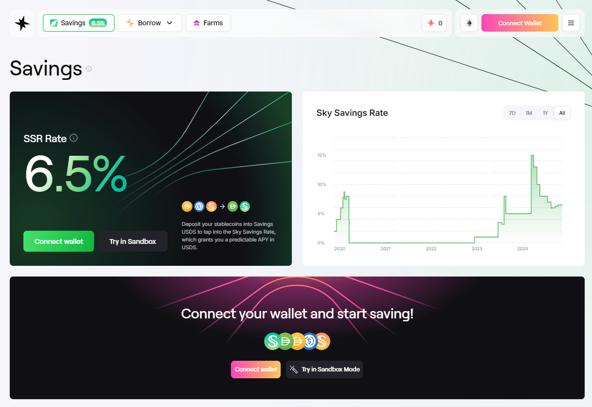
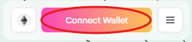
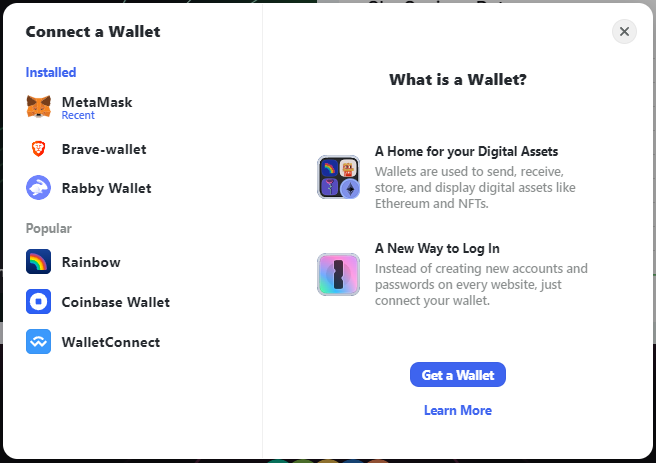
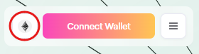
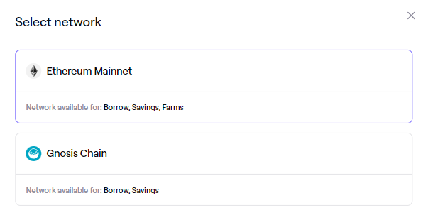
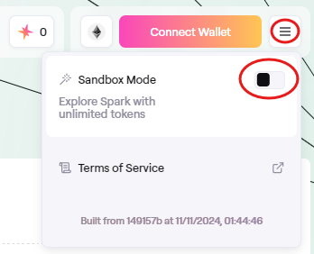
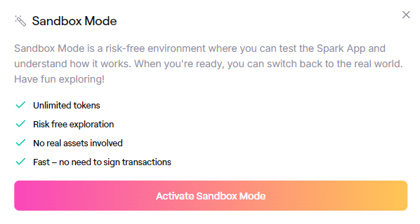

# Getting Started

## Accessing Spark App

The Spark App can be accessed at:

* [app.spark.fi](http://app.spark.fi) (also via IPFS)

To enter the site, you must accept the [Terms of Service](https://spark.fi/terms-of-use.html).

## Application Overview

The Spark App consists of five main sections - click on a section title for specific tutorials:

1. [**Savings**](earning-savings/) - The landing page of the application hosts Savings. Savings enables you to deposit stablecoins to earn savings using Savings USDS (sUSDS).
2. **Borrow** - Contains three sections:
   1. [**Borrow DAI and USDS**](using-sparklend/borrow-dai-and-usds.md), which enables you to borrow USDS and DAI using crypto assets as collateral. This section is focused on USDS and DAI borrowing only.
   2. [**My portfolio**](using-sparklend/borrowing-assets.md) - Shows the state of your borrow and lending position. Here you can also manage lending and borrow positions of any supported asset.
   3. [**Markets**](using-sparklend/overview-of-markets.md) **-** gives an overview of the total state of the supported lending markets, such as total liquidity and total borrows. Offers detailed information for each market, and the option to enter the markets.
3. [**Farms**](farming-rewards/) - Enables users to deposit tokens into farms to earn Sky Token Rewards.

<figure><figcaption>
Spark App Landing Page
</figcaption></figure>

### Connecting Your Wallet

In order to access the Spark App you must connect a crypto wallet. You do so, by clicking “Connect Wallet” in the top right corner of the app, select your wallet of choice, and finalize the connection process for the specific wallet. E.g. when selecting MetaMask, you will be prompted to log in to your MetaMask wallet through the browser extension.

<figure><figcaption>
The Connect Wallet Button in the Top Right corner of the Spark App
</figcaption></figure>

<figure><figcaption>
Connect to Spark with your favorite wallet
</figcaption></figure>

### Selecting Network

Make sure you are connected to the desired blockchain network.

In the top right corner, you are able change between blockchain networks supported by Spark. The current supported networks are Ethereum Mainnet and Gnosis Chain. You can find an overview of what assets are supported on which network on the “Markets” page.

<figure><figcaption>
Network Selection
</figcaption></figure>

<figure><figcaption>
Network Selection
</figcaption></figure>

### Sandbox Mode

If you wish to test out the Spark Application you can click on the three dots (…) next to Connect Wallet  and click on the Sandbox mode. This will give you access to a newly generated test wallet with test funds on a test network, giving you the option to familiarize yourself with the application before spending any real funds.

<figure><figcaption>
Sandbox Mode
</figcaption></figure>

<figure><figcaption>
Activate Sandbox Mode
</figcaption></figure>
